## Hi, I'm Sanjay

I'm a software engineer in Seattle working on backend systems, native apps, and developer tools. I contribute upstream fixes across language tooling, developer infrastructure, and web applications.

**[Merged pull requests](https://github.com/pulls?q=is%3Apr+author%3ASanjays2402+is%3Amerged)** · **[LinkedIn](https://www.linkedin.com/in/sanjay24/)**

## Open-source contributions

### Selected merged contributions

| Project | Change merged upstream | Pull request |
| :--- | :--- | :--- |
| **[OpenClaw](https://github.com/openclaw/openclaw)** | Fixed duplicate Telegram forum-topic replies and missing transcript mirrors. | [#158054](https://github.com/openclaw/openclaw/pull/158054) |
| **[Pygments](https://github.com/pygments/pygments)** | Fixed JSX highlighting so apostrophes in element text no longer produce error tokens. | [#3214](https://github.com/pygments/pygments/pull/3214) |
| **[Ruff](https://github.com/astral-sh/ruff)** | Removed false-positive D418 diagnostics for docstrings on overloaded functions in stub files. | [#26318](https://github.com/astral-sh/ruff/pull/26318) |
| **[rclone](https://github.com/rclone/rclone)** | Stopped remote-control jobs that transfer no files from leaking stats goroutines. | [#9568](https://github.com/rclone/rclone/pull/9568) |
| **[Hermes WebUI](https://github.com/nesquena/hermes-webui)** | Fixed message submission on touch devices with external keyboards. | [#3130](https://github.com/nesquena/hermes-webui/pull/3130) |

**More of my work in these projects:** [OpenClaw](https://github.com/openclaw/openclaw/pulls?q=is%3Apr+author%3ASanjays2402) · [Pygments](https://github.com/pygments/pygments/pulls?q=is%3Apr+author%3ASanjays2402) · [Ruff](https://github.com/astral-sh/ruff/pulls?q=is%3Apr+author%3ASanjays2402) · [rclone](https://github.com/rclone/rclone/pulls?q=is%3Apr+author%3ASanjays2402) · [Hermes WebUI](https://github.com/nesquena/hermes-webui/pulls?q=is%3Apr+author%3ASanjays2402)

## Open-source projects I build

| Project | What it does | Built with |
| :--- | :--- | :--- |
| **[retrace](https://github.com/Sanjays2402/retrace)** | Resumes interrupted Python workflows from SQLite checkpoints, with durable retries and a live execution inspector. Zero runtime dependencies. | Python · asyncio · SQLite |
| **[ferry](https://github.com/Sanjays2402/ferry)** | Runs background tasks with priorities, retry backoff, scheduling, crash recovery, and a live dashboard. | Python · SQLite · Redis |
| **[city-friction-map](https://github.com/Sanjays2402/city-friction-map)** | Maps everyday city obstacles so neighbors can report, verify, and share them. Includes trip checks, public city feeds, and CSV/GeoJSON export. | JavaScript · Express · SQLite · Leaflet |
| **[copilot-usage-tracker](https://github.com/Sanjays2402/copilot-usage-tracker)** | Tracks enterprise Copilot usage and costs, with team attribution, budgets, trends, and per-user drill-downs. | Python · Streamlit · SQLite |
| **[Tilt](https://github.com/Sanjays2402/Tilt)** | Turns MacBook lid movement into live depth, blur, and frosted-glass effects rendered on the GPU. | Swift · SwiftUI · Metal · ScreenCaptureKit |

[Try the Retrace recovery playground →](https://sanjays2402.github.io/retrace/)

More projects

[optune](https://github.com/Sanjays2402/optune) · [snip](https://github.com/Sanjays2402/snip) · [tsk](https://github.com/Sanjays2402/tsk) · [core-stealth](https://github.com/Sanjays2402/core-stealth) · [flight-sim](https://github.com/Sanjays2402/flight-sim)

[ai-particle-simulator](https://github.com/Sanjays2402/ai-particle-simulator) · [slab](https://github.com/Sanjays2402/slab) · [clawmind](https://github.com/Sanjays2402/clawmind) · [triple-tic-tac-toe](https://github.com/Sanjays2402/triple-tic-tac-toe) · [data-forge](https://github.com/Sanjays2402/data-forge)

[ascii-webcam](https://github.com/Sanjays2402/ascii-webcam) · [devdash](https://github.com/Sanjays2402/devdash) · [memory-matrix](https://github.com/Sanjays2402/memory-matrix) · [2048-game](https://github.com/Sanjays2402/2048-game) · [snippet-dev](https://github.com/Sanjays2402/snippet-dev)

[gitsight](https://github.com/Sanjays2402/gitsight) · [clawreview](https://github.com/Sanjays2402/clawreview) · [context-clipboard](https://github.com/Sanjays2402/context-clipboard) · [signalclaw](https://github.com/Sanjays2402/signalclaw) · [clawhum](https://github.com/Sanjays2402/clawhum)

[adherence-ml](https://github.com/Sanjays2402/adherence-ml) · [codeclone](https://github.com/Sanjays2402/codeclone) · [CakePond](https://github.com/Sanjays2402/CakePond) · [sunsprout](https://github.com/Sanjays2402/sunsprout) · [gta-vibes](https://github.com/Sanjays2402/gta-vibes)

[pixel-forge](https://github.com/Sanjays2402/pixel-forge) · [url-shortener](https://github.com/Sanjays2402/url-shortener) · [secure-notes-app](https://github.com/Sanjays2402/secure-notes-app) · [realtime-log-monitor](https://github.com/Sanjays2402/realtime-log-monitor) · [personal-file-backup](https://github.com/Sanjays2402/personal-file-backup)

## Tools I work with

  
  
  
  
  
  
  
  

- **Backend & systems:** task queues, durable workflows, APIs, and data storage.
- **Native & web:** macOS apps, browser interfaces, and WebGL.
- **Developer tooling:** CLI/TUI tools, ML tooling, and debugging.
